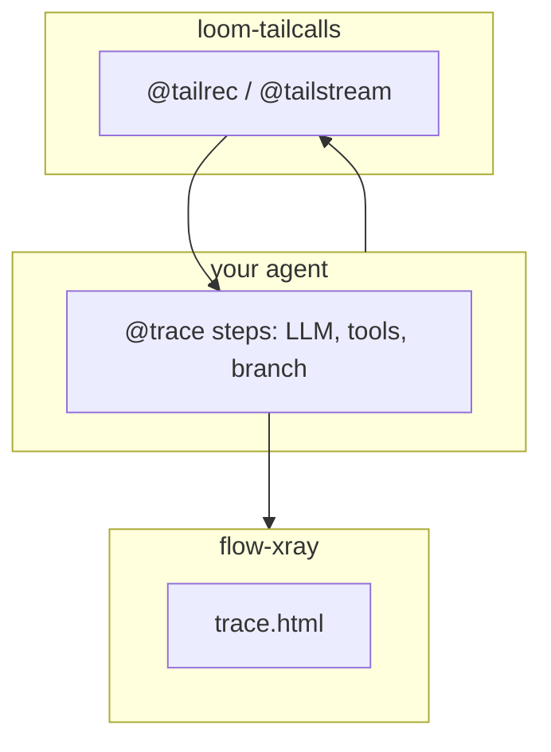

# ROADMAP: loom-tailcalls + flow-xray

Источник правды для обоих пакетов. Опирается на [`demo-loom-flow/`](.) — integration lab, не marketing.

**Горизонты:** v0.2 (shipped) · v0.3–0.4 (6–12 мес) · long-term (12+ мес)

---

## 1. Vision

Два слоя одного стека для async agent loops в Python:



| Пакет | Роль | Не является |
|-------|------|-------------|
| **loom-tailcalls** | Форма цикла: `state → await → next state`, stack O(1) | LangGraph, Temporal, agent framework |
| **flow-xray** | Observability: граф вызовов, tokens, errors → local HTML | LangSmith, hosted tracing |

**Loom** — как пишешь loop. **flow-xray** — что реально вызывалось внутри.

---

## 2. Integration contract

Паттерн из demo (case 01, [`agent_demo.py`](agent_demo.py)):

### Делай так

```python
@trace
async def call_ollama(prompt): ...

@trace
async def run_tool(state, action): ...

@tailrec
async def agent_loop(state):
    ...
    await call_ollama(...)
    value = await run_tool(state, action)
    return await agent_loop(state.apply(value))

trace.run(lambda: asyncio.run(agent_loop(initial)))
```

- **`@tailrec` / `@tailstream`** — только на loop
- **`@trace`** — на leaf steps (LLM, tool, branch), hooks снаружи loop (case 05)
- **`trace.run()`** — entry для HTML; не `flow-xray run` если main guard (см. flow-xray docs)

### Не делай так

- `@trace` на тот же `@tailrec` loop → один «толстый» узел на весь run, граф бесполезен
- LLM на каждый шаг 100k loop → anti-pattern (case 02 намеренно без Ollama)
- Ждать, что flow-xray «увидит» internal `while` Loom — transform скрыт; видны только traced leaves

### Что demo доказало

| Case | Наблюдение | Следствие |
|------|------------|-----------|
| 01 | Loop невидим в HTML, видны `call_ollama` / `run_tool` | Integration pattern выше — canonical |
| 02–03 | Loom 100k OK, plain RecursionError @10k | Core value подтверждён |
| 04 | `@tailstream` + trace OK, events не привязаны к iteration | flow-xray roadmap: stream timeline |
| 05 | Hooks вне `@tailrec` работают | Official Loom pattern |
| 06–07 | unittest + Ollama fuzz pass | `run_all_cases.py` = smoke gate |

---

## 3. loom-tailcalls roadmap

### v0.2 — shipped (2026-05-31)

| Item | Status |
|------|--------|
| `**kwargs` в tail-call | **shipped** |
| `try`/`with`/inner-loop tail calls | **shipped** |
| Case 08: `explain_tailcalls` smoke | **shipped** — [`cases/08_explain_tailcalls_smoke.py`](cases/08_explain_tailcalls_smoke.py) |
| README link → demo + integration contract | **shipped** — root [`README.md`](../README.md) |

### v0.3–0.4 (6–12 мес) — DX и patterns

| Item | Why | Risk | Depends on |
|------|-----|------|------------|
| Docs: hooks, budget, streaming | cases 04–05 → loom `docs/` | Low | examples stable |
| Bench case в runner (100k loom vs while) | README claims ~1.1–1.2× | Env noise | [`scripts/bench_tailcalls.py`](../loom/scripts/bench_tailcalls.py) |
| PyPI README: «Works with flow-xray» | ecosystem story | Low | flow-xray link |
| Rejection hints улучшить для новых shapes | DX | Low | v0.2 shapes landed |

### Long-term (12+ мес) — только при явном кейсе

| Item | Why | Risk | Depends on |
|------|-----|------|------------|
| Mutual tail recursion | Rare in agent loops | Новый transform + proof | demand signal |
| Checkpoint/resume | User ask | Scope creep → Temporal layer | **non-goal for Loom core** |

**Non-goals (Loom):**

- Agent framework (tools, persistence, graph UI)
- Bytecode-input transform (ROI низкий, другой proof surface; `getsource` остаётся)
- «Больше шагов чем while» — Loom про **форму**, не лимит while

---

## 4. flow-xray roadmap

### Near (3–6 мес) — agent loop observability

| Item | Why | Risk | Depends on |
|------|-----|------|------------|
| **Iteration grouping** | case 01: 30× `call_ollama` — плоский список | UI complexity | trace schema |
| **tailstream timeline** | case 04: yield events оторваны от step | Stream model | `@tailstream` event shape |
| Doc «Tracing Loom loops» | trace leaves only | Low | demo ROADMAP §2 |

### Mid (6–12 мес) — recipes

| Item | Why | Risk | Depends on |
|------|-----|------|------------|
| Ollama agent recipe | [`ollama_client.py`](ollama_client.py) ad-hoc в demo | Not core dep | examples/ in flow-xray repo |
| Redaction recipe для agent traces | secrets in prompts | Low | existing `redact=`, `capture_output=False` API |
| Link to demo-loom-flow from flow-xray README | single source of truth | Low | this file |

### Long-term (12+ мес)

| Item | Why | Risk | Depends on |
|------|-----|------|------------|
| Optional Loom awareness | read `fn.__loom_tailcalls__` → annotate «binding=direct» | Soft dep on loom | stable report API |
| Trace diff regression gate | `trace.diff` для agent behavior | UX | two-run workflow |

**Non-goals (flow-xray):**

- Hosted tracing / team dashboards (LangSmith territory)
- Agent orchestration
- Production monitoring / long-term storage

---

## 5. Shared ecosystem

| Item | Status | Action |
|------|--------|--------|
| [`run_all_cases.py`](run_all_cases.py) | done | Smoke gate перед релизом either package |
| [`ROADMAP.md`](ROADMAP.md) | this file | Update when demo/cases change |
| loom [`README.md`](../README.md) | todo | One paragraph + link here |
| flow-xray README (kroq86/flow-xray) | todo | Same link on publish |
| GitHub Action: cases 01–07 on schedule | future | optional CI in demo or loom repo |

**Release checklist (manual, пока нет CI):**

```bash
cd demo-loom-flow
source .venv/bin/activate
LOOM_RUN_OLLAMA=1 python run_all_cases.py
# all OK or expected SKIP
```

---

## 6. Explicit non-goals (оба пакета)

1. **Не LangGraph / Temporal** — другой слой (оркестрация vs loop primitive vs observability).
2. **Demo ≠ production template** — reference architecture; copy patterns, not `ollama_client.py` verbatim.
3. **Не «fix recursion users already write»** — форма, которой в async Python не было.
4. **Не LLM-on-every-step at scale** — case 02 = stress без LLM by design.
5. **Не machine-checked Coq proof** — formal-core on paper + contract tests; honest in docs.

---

## Changelog

| Date | Change |
|------|--------|
| 2026-05-31 | Initial roadmap from demo-loom-flow cases 01–07 |
